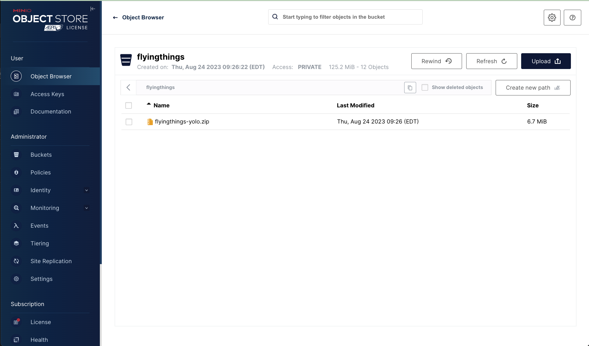
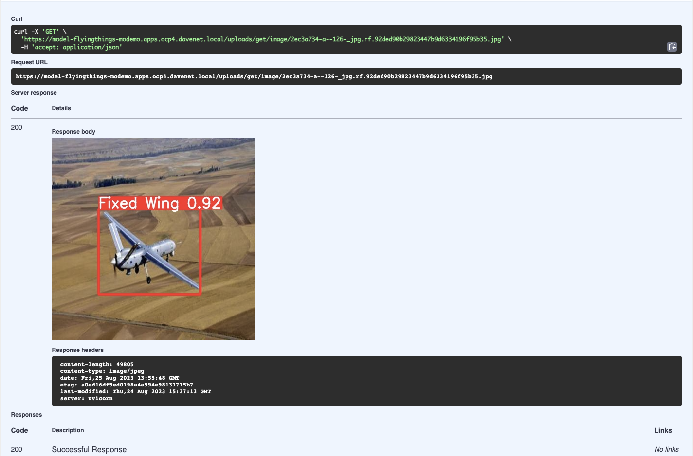

# Computer vision demo

This workshop is designed to showcase OpenShift as a platform for developing and operationalizing AI/ML applications. It uses many tools in the Red Hat ecosystem as well as 3rd party applications and services. This particular workshop features a computer vision implementation and covers a workflow for custom training and serving for integration with other applications and services.

I've created a video series explaining the workshop and a runthrough of the setup and use cases here.
[](https://www.youtube.com/playlist?list=PLWGcJxV1EWOCQWd1aRss4zUT4zgZCSQ19)


## Prerequisites

- Nvidia GPU hardware
- OpenShift 4.11+ w/ cluster admin
- AWS (auto scaling, optional)
- OpenShift Dev Spaces 3.8.0+ (optional)
- Internet access

Red Hat Demo Platform Catalog (RHDP) options:

- `MLOps Demo: Data Science & Edge Practice`
- `Red Hat OpenShift Container Platform 4 Demo`

## Quickstart

```
# cluster tasks
scripts/bootstrap.sh

# namespace tasks
scripts/00-setup-components.sh
scripts/01-setup-pipelines.sh
scripts/02-run-train-model.sh
```
## Workshop Components


### OpenShift

OpenShift is the foundation of everything we’re using today. Its ability to securely run containerized workloads makes it ideal for our purposes. Since the nature of Data Science is experimentation and many many iterations, its ability to consistently deploy and maintain multiple environments and configurations makes it a great foundation for ML Operations.

### Red Hat OpenShift Pipelines

OpenShift Pipelines is the engine that drives our operation. All of the elements and tasks that make up our workflow have been automated and are managed by Tekton. As it’s a Kubernetes native CI tool, it helps establish workflows that ensure consistent results with the flexibility to extend capabilities at any time.

### Minio

Minio is an S3 compatible open source object storage service we’ll be using to store our artifacts. It's lightweight and easily deployed to Openshift.

### Yolo

Yolo is written in Python so the workshop is mostly coded in Python. We’ll be using Python 3.9 so feel free to poke around in the code for anything useful.

### FastAPI

For basic model serving we’ll be using FastAPI. It’s lightweight and fairly simple to deploy with our model and it has an excellent SWAGGER interface which comes in handy for testing our model and even serving it to other applications and services.

### Label Studio

And finally there’s LabelStudio. LabelStudio is an annotation tool used to label datasets for input into AI/ML system training. We’ll be using it to collect and label our image datasets.

## Workflow


### Collect images

Ideally gather many images of all objects we want to detect from different angles and lighting conditions.

### Annotate images

Annotation is the process of identifying objects in an image and drawing bounding boxes around them. Each image could have multiple different or same objects so the more thorough you are in labeling the more accurate your model will predict.

### Export Artifacts

Once annotation is complete, we export the images, annotations, and classes in a format Yolo can use for training. This is stored in our object storage.

### Launch Pipeline

We give our pipeline parameters like the name of our model, where the annotation export is, and what values to use during the training. Once the training is complete the pipeline stores artifacts from the session as well as additional export formats of the model so it can be consumed by a host of other model servers. The artifacts are again stored in our object storage.

### Test Model

Since our model was deployed with a FastAPI application we can easily test it with the swagger interface.

### Capture missed predictions

During the testing portion it is important to test on images that were not part of the dataset. This will reveal any precision issues with the model. Missed or low confidence predictions can be collected and input back into the pipeline.

### Add images to dataset

We can collect all the missed images and add them to LabelStudio where they will now be part of that dataset going forward.

### Repeat

We then annotate, as before, and repeat the process until we have acceptable confidence levels in our predictions.

## The Pipeline


- Fetch repo pulls our git repo code into the pipeline workspace.
- Get Dataset pulls our zip file into the workspace and unzips it.
- Create Classfile picks up the classes.txt file and converts it to a YAML file that can be - consumed by YOLO. This is a template which also identifies the folder structure for the - training.
- If the image resize flag is set, the images will be resized to a maximum width. This module - can be used in the future for other image pre-processing that help improve accuracy.
- Distribute Dataset groups the files into 3 groups. 70% go to training, 30% go to test, and - 30% go to validation. The groups are then moved to their respective directories for training. - This grouping is done randomly each run.
- If the GPU flag is set the training requests a node with GPU and runs the actual training on - that node. If GPU is not set, the training is done with CPUs.
- Once training is complete the resulting model is exported to onnx format for consumption by - other model serving solutions.
- Now, all the artifacts from the training including the reports, model, class file, and - exports are written to object storage where they are tagged and propagated to appropriate - folders.
- If the Deploy flag is set, the FastAPI app is deployed with the latest model.
- Finally a summary of the pipeline run is presented with parameter information.

## Getting Started

### Prerequisites

- An OpenShift cluster at version 4.13 or greater.
  - Single Node Openshift with at least 32GB RAM will be adequate
  - GPU Enabled Node (Optional)
  - OCP internal registry
  - OpenShift Pipelines Operator
  - Dynamic Storage Provisioning (ODF, LVM Storage, etc)
  - Cluster Admin
- Workstation with terminal (RHEL or CentOS Streams with bash or zsh)
  - Git client
  - Tekton client
- Optional
  - Still camera
  - Webcam

## Building the workshop

1. Login to your cluster from your workstation.
2. Clone the repository to your workstation.

```
git clone < repo >
```

3. Go to the directory flyingthings/bootstrap and run script 01-create-pipelines.sh with the name of the project where you will be deploying the workshop.

```
scripts/01-create-pipelines.sh
```

4. Run script 02-build-images-tkn.sh with the same project used for the previous step.

```
scripts/02-build-images-tkn.sh
```

This process will take some time as the images for the workshop are created. Allow 10 to 30 minutes to complete.

Let’s take a look at what actually got created and deployed.

In Deployments, we see three apps. LabelStudio, Minio, and model-yolo.  Let’s start with Minio. We can use the route to connect to the Minio console. The username and password is minioadmin.  We can see that there is a bucket already created called “flyingthings”.  In this bucket the main thing to notice is the zip file called “flyingthings-yolo”.  This is the main artifact used in training our custom model. More on that in a bit.



We’ll come back to LabelStudio later, but let’s take a look at model-yolo. As part of the workshop startup, we deploy a default yolo model. This is useful as a baseline for what yolo can do out of the box and it’s a good introduction for the SWAGGER interface. After clicking on its route, simply append /docs to the url to access swagger.


All of the endpoints are listed here with some basic documentation and the ability to actually send and receive data. This comes in handy as you don’t need to bother with a client that supports POST requests when you need to do simple testing. So let’s do a quick test. Expand the Detect function and click “Try It Out” to activate the panel. Now we can pick an image file to upload and have our model make a prediction. Let’s pick something good.  Perfect! Our model has predicted 20 donuts in our image. There’s also an endpoint to show the image marked up with bounding boxes and confidence scores, so let’s try that one. And, yes. We see 20 predictably delicious donuts.


Our pipeline has the option to deploy this same model server for any custom model we create. This will come in handy for the workshop.

## Workshop Use Case 1

### Overview

We’re going to make a custom model that can detect helicopters and airplanes. For this model, I’ve downloaded hundreds of images of planes and helicopters from Kaggle and already created annotations for the set. You will see it in the flyingthings-yolo.zip file in the bucket.

If we unzip the file you will find the class file and folders containing the images and the labels.

```
flyingthings-yolo $ ls -al
total 92
drwxrwsrwx. 4 user 1000820000  4096 Aug 25 13:43 .
drwxrwsrwx. 3 user 1000820000  4096 Aug 25 13:42 ..
-rw-r--r--. 1 user 1000820000    23 Jun 11 08:00 classes.txt
drwxr-sr-x. 2 user 1000820000 40960 Jun 11 08:00 images
drwxr-sr-x. 2 user 1000820000 36864 Jun 11 08:00 labels
-rw-r--r--. 1 user 1000820000   226 Jun 11 08:00 notes.json
flyingthings-yolo $ 
```

You can see the class file contains the two classes we care about, fixed wing and rotor aircraft. The images folder has over 300 pictures of all kinds of planes and helicopters. The labels folder contains all the labels for the images. In the file is the class id and coordinates of the bounding boxes. As a general rule, the more representations of objects in the dataset the more accurate the predictions. There are exceptions, but you should always try to get the most instances of the cleanest data possible.

Alright, now it’s time to run the pipeline and get our first custom model.

## Launch the pipeline

Go to the same directory as before, flyingthings/bootstrap and edit the file 10-run-model-flyingthings-training.sh to change any parameters for this run.

```
vi scripts/03-run-train-model.sh
```

All the supplied params should be fine, but we will want to change a few if we’re not running a GPU.  If your system has no available GPUs then set *GPU* to *N*. Also, since there is no GPU we’ll need to change the *BATCH_SIZE* as it is set to maximize if there are GPUs. You should set it to 2 to avoid any memory issues.  

```
tkn pipeline start train-model \
  -w name=source,volumeClaimTemplateFile=pvc.yaml \
  -w name=shared-workspace,volumeClaimTemplateFile=pvc.yaml \
  -p GIT_URL=https://github.com/redhat-na-ssa/flyingthings.git \
  -p GIT_REVISION=main \
  -p MODEL_BASE="yolov5s.pt" \
  -p BATCH_SIZE="-1" \
  -p NUM_EPOCHS="100" \
  -p IMG_RESIZE="Y" \
  -p MAX_WIDTH="200" \
  -pMODEL_WEIGHTS=flyingthings.pt \
  -p DATASET_ZIP=flyingthings-yolo.zip \
  -p MINIO_ENDPOINT=http://minio:9000 \
  -p MINIO_ACCESSKEY=minioadmin \
  -p MINIO_SECRETKEY=minioadmin \
  -p MINIO_BUCKET=flyingthings \
  -p MODEL_NAME=model-flyingthings \
  --use-param-defaults --showlog
```

Now execute the script on the project we’ve been using.

```
scripts/03-run-train-model.sh
```

As the job kicks off we can monitor it from the console. Here we see all the training tasks displayed for the pipeline. With GPUs it should take around 5 or 6 minutes to run. CPUs will take significantly longer.


We see that our model was deployed to model-flying things. Let’s click on its route and launch the app.`


As before, add /docs to the URL to bring up the swagger interface.  Let’s send an image of a plane and see how well it inferences.

Success! We have successfully identified something not in the original yolo model.



## Review

Now, let’s review what we’ve done so far.

- Deployed pipeline and supporting tools/images to OpenShift
- Deployed pre-annotated images to object storage for input into pipeline
- Instantiated pipeline to build custom Yolo model where the pipeline:
  - ingested images, labels, and class files
  - preprocessed images by resizing them to a maximum width``
  - distributed images to “train”, “test”, and “valid” groups for Yolo training
  - trained a custom yolo model
  - exported our custom model to “onnx” format
  - saved our model, export, and training artifacts to object storage
  - Deployed our custom model to OpenShift in a containerized FastAPI application
- Validated our custom model by interacting with API endpoints
