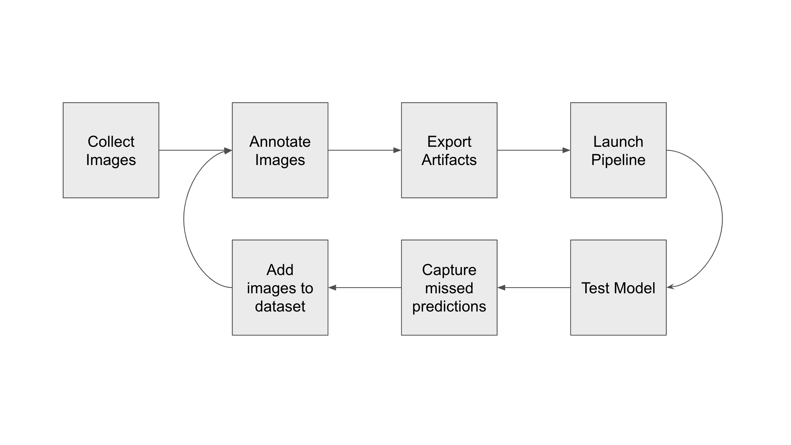
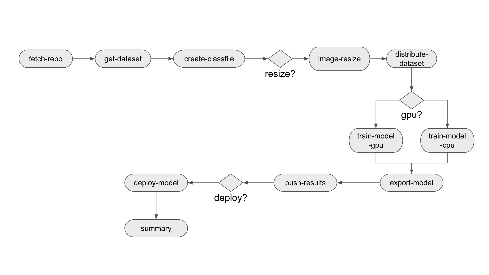
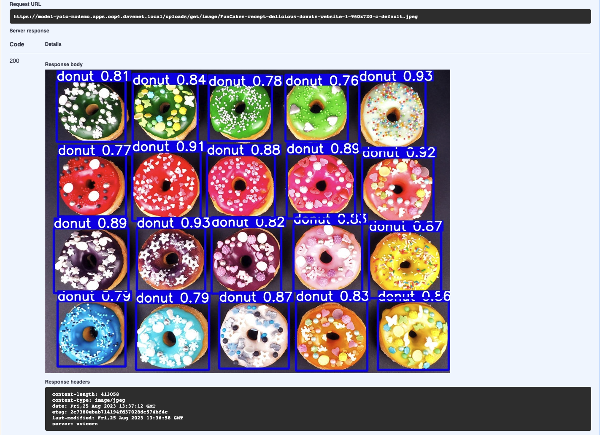

# Workshop

## Workshop Components


### OpenShift

OpenShift is the foundation of everything we’re using today. Its ability to securely run containerized workloads makes it ideal for our purposes. Since the nature of Data Science is experimentation and many many iterations, its ability to consistently deploy and maintain multiple environments and configurations makes it a great foundation for ML Operations.

### Red Hat OpenShift Pipelines

OpenShift Pipelines is the engine that drives our operation. All of the elements and tasks that make up our workflow have been automated and are managed by Tekton. As it’s a Kubernetes native CI tool, it helps establish workflows that ensure consistent results with the flexibility to extend capabilities at any time.

### Minio

Minio is an S3 compatible open source object storage service we’ll be using to store our artifacts. It's lightweight and easily deployed to Openshift.

### Yolo

Yolo is written in Python so the workshop is mostly coded in Python. We’ll be using Python 3.9 so feel free to poke around in the code for anything useful.

### FastAPI

For basic model serving we’ll be using FastAPI. It’s lightweight and fairly simple to deploy with our model and it has an excellent SWAGGER interface which comes in handy for testing our model and even serving it to other applications and services.

### Label Studio

And finally there’s LabelStudio. LabelStudio is an annotation tool used to label datasets for input into AI/ML system training. We’ll be using it to collect and label our image datasets.

## Workflow



### Collect images

Ideally gather many images of all objects we want to detect from different angles and lighting conditions.

### Annotate images

Annotation is the process of identifying objects in an image and drawing bounding boxes around them. Each image could have multiple different or same objects so the more thorough you are in labeling the more accurate your model will predict.

### Export Artifacts

Once annotation is complete, we export the images, annotations, and classes in a format Yolo can use for training. This is stored in our object storage.

### Launch Pipeline

We give our pipeline parameters like the name of our model, where the annotation export is, and what values to use during the training. Once the training is complete the pipeline stores artifacts from the session as well as additional export formats of the model so it can be consumed by a host of other model servers. The artifacts are again stored in our object storage.

### Test Model

Since our model was deployed with a FastAPI application we can easily test it with the swagger interface.

### Capture missed predictions

During the testing portion it is important to test on images that were not part of the dataset. This will reveal any precision issues with the model. Missed or low confidence predictions can be collected and input back into the pipeline.

### Add images to dataset

We can collect all the missed images and add them to LabelStudio where they will now be part of that dataset going forward.

### Repeat

We then annotate, as before, and repeat the process until we have acceptable confidence levels in our predictions.

## The Pipeline



- Fetch repo pulls our git repo code into the pipeline workspace.
- Get Dataset pulls our zip file into the workspace and unzips it.
- Create Classfile picks up the classes.txt file and converts it to a YAML file that can be - consumed by YOLO. This is a template which also identifies the folder structure for the - training.
- If the image resize flag is set, the images will be resized to a maximum width. This module - can be used in the future for other image pre-processing that help improve accuracy.
- Distribute Dataset groups the files into 3 groups. 70% go to training, and the remaining 30% are split between test and validation. The groups are then moved to their respective directories for training. - This grouping is done randomly each run.
- If the GPU flag is set the training requests a node with GPU and runs the actual training on - that node. If GPU is not set, the training is done with CPUs.
- Once training is complete the resulting model is exported to onnx format for consumption by - other model serving solutions.
- Now, all the artifacts from the training including the reports, model, class file, and - exports are written to object storage where they are tagged and propagated to appropriate - folders.
- If the Deploy flag is set, the FastAPI app is deployed with the latest model.
- Finally a summary of the pipeline run is presented with parameter information.

## Getting Started

### Prerequisites

- An OpenShift cluster at version 4.12 or greater.
  - Single Node Openshift with at least 32GB RAM will be adequate
  - GPU Enabled Node (Optional)
  - OCP internal registry
  - OpenShift Pipelines Operator
  - Dynamic Storage Provisioning (ODF, LVM Storage, etc)
  - Cluster Admin
- Workstation with terminal (RHEL or CentOS Streams with bash)
  - Git client
  - Tekton client
- Optional
  - Still camera
  - Webcam

## Building the workshop

For this workshop we'll be interacting with environment through a browser. Once you have logged into your lab environment with the proper credentials, we're going to launch the terminal and clone our repo.

1. Login to your cluster from your workstation.
2. You will be in the "Developer" view of the console. You should see an icon near the top right of the screen resembling a command prompt `>_`  Click this button to launch the terminal.

- Note: this will launch a container with ephemeral storage, so try not to close it as it will lose anything downloaded or edited. Fortunately you can easily recover if this happens.

3. Clone the repository to your terminal session.

```
git clone https://github.com/redhat-na-ssa/flyingthings.git
```

4. Go to the directory flyingthings and create the project where you will be deploying the workshop. Checkout the `workshop` branch

```
cd flyingthings
git checkout workshop
```

5. We're going to deploy the YOLOv8 pre-trained model to our cluster.

- Note: all scripts must be run from the project root.

```
scripts/03-deploy-model-yolo.sh
```

This script simply deploys the yolo model in a FASTApi wrapper to allow us to interact with the endpoints. We'll go through some exercises to see how to use it as a test or even with an application.


All of the endpoints are listed here with some basic documentation and the ability to actually send and receive data. This comes in handy as you don’t need to bother with a client that supports POST requests when you need to do simple testing. So let’s do a quick test.

## Testing the model

1. Expand the Detect function and click `Try It Out` to activate the panel.
2. Now we can pick an image file to upload and have our model make a prediction. Let’s pick something good.
[]( "Download image")
3. Download the above image and use the Swagger interface to send it to our model.
4. Perfect! In the output we see our model has predicted 20 donuts in our image.
5. There’s also an endpoint to show the image marked up with bounding boxes and confidence scores, so let’s try that one.

- From the output copy the name of the file Navigate to `/uploads/get/image/{fname}` and enter the name from the previous output `FunCakes-recept-delicious-donuts-website-1-1000x750.jpg`

6. And, yes. We see 20 predictably delicious donuts.



## Workshop Use Case 1

Using an existing model is a great way to jump start a project as you can use fine tuning or re-training to adapt it to your needs. Let's say we need to detect airplanes and helicopters. We'll see how well the pre-trained model does.

1. Go back to our `model-yolo` app.
2. Download the following images for input.

- [Download Plane Image](https://raw.githubusercontent.com/redhat-na-ssa/flyingthings/main/docs/images/f16.jpeg)
- [Download Heli Image](https://raw.githubusercontent.com/redhat-na-ssa/flyingthings/main/docs/images/heli01.jpg)

3. Test each of the images with the Swagger interface and see how well it detects each by the confidence score in the bounding box image.

So we see it can detect the airplane fairly well but totally misses the helicopter classification.

### Overview

We’re going to make a custom model that can detect helicopters and airplanes. For this model, I’ve downloaded hundreds of images of planes and helicopters from Kaggle and already created annotations for the set. You will see it in the `flyingthings-yolo.zip` file in the bucket. Download this file to your workstation.

### NOTE: this portion will be demonstrated by the workshop lead

We'll see how we can train the default Yolov8 model to detect custom classes.

## Workshop Use Case 2

### Overview

Now that we know that a pre-trained model can be adapted for custom classifications, let's introduce a completely new dataset.

- Our scenario: detect individual automobiles from a set of HO Scale miniatures.

## Labeling our data

Let's take a look at the apps. We do this by navigating to "Topology" on the left menu. If the project selector at the top of the page is not set to your username click and select it from the list.

- Find the icon for `label-studio` and click on the call-out arrow on the upper right of the icon. This should launch label-studio.

- Log in with <user1@example.com> password1
You should see only one project.


- Click on that project to show all assets.

- click on an image to see the classes and bounding boxes


If you want, you can find unlabeled images and annotate them by selecting the class and drawing a box around instances in the image.

- Now we'll export our annotated images in Yolo format and use them to train out model. From the upper right menu click on `Export`


- Be sure to select YOLO


- Save or rename the downloaded file as `hoscale.zip`

## Upload our training data

Now that we have images and labels for training we will upload them to our S3 compatible bucket on our cluster.

- Back on our OpenShift console, find the icon for `minio` and click the call-out arrow to launch. The username and password are `minioadmin`


1. From the "Administrator" menu on the side click "Buckets"
2. Click "Create Bucket" and name it "hoscale". All defaults are fine.
3. Under "User" click "Object Browser" and navigate to your new bucket.
4. Click "Upload File" and select our export "hoscale.zip"

Once the upload is complete we're almost ready to train our custom model.
We just need to make a new training script and we're on our way.

### HOScale training script

1. If you web terminal is still active return to your command prompt, if not you'll need to launch a new one and re-clone the repo.
2. You will see the training script we will use to retrain the Yolo model. `scripts/04-run-train-hoscale.sh`

```sh
scripts/04-run-train-hoscale.sh
```

The output of the job should spool by in the terminal, but you can also monitor it from the console itself. To avoid inadvertently closing the terminal,

1. launch a new console by right clicking on the Red Hat Openshift logo in the upper left corner and select "Open link in new tab".
2. Navigate to "Pipelines". You should see a pipeline running with a flooder bar progressing. Click on the bar and you'll see all the tasks progressing with their output logs displayed.

As the job kicks off we can monitor it from the console. Here we see all the training tasks displayed for the pipeline. With GPUs it should take around 5 or 6 minutes to run. CPUs will take significantly longer.


It will take some time to complete, but when finished you will see the summary and have a new app deployed with your model AND artifacts from the training in your minio bucket.

### Test the new model

1. From our "Routes" you should now see the "model-hoscale" app. Click to launch the Swagger interface.
2. Use images in the "hoscale" folder to test the model.

## Review

Now, let’s review what we’ve done so far.

- Deployed pipeline and supporting tools/images to OpenShift
- Deployed pre-annotated images to object storage for input into pipeline
- Instantiated pipeline to build custom Yolo model where the pipeline:
  - ingested images, labels, and class files
  - preprocessed images by resizing them to a maximum width``
  - distributed images to “train”, “test”, and “valid” groups for Yolo training
  - trained a custom yolo model
  - exported our custom model to “onnx” format
  - saved our model, export, and training artifacts to object storage
  - Deployed our custom model to OpenShift in a containerized FastAPI application
- Validated our custom model by interacting with API endpoints

## Extra Credit

We've only scratched the surface here with our platform capabilities. Usually we will want an application to interact with our model. So, for extra credit, I've created a simple app to interact with our model.

We'll start with the pre-trained model but you can easily adapt it to our custom models.

1. From our terminal go back to the home directory and clone this repo.

```sh
cd
git clone https://github.com/davwhite/cvbrowser.git
```

1. Build the image.

```cvbrowser/build-is.sh```

1. Edit the deployment for your cluster.

```sh
  - name: DETECT_URL
    value: "https://model-yolo-ml-demo.apps.<your.cluster.name>/detect"
  - name: GET_IMAGE_URL
    value: "https://model-yolo-ml-demo.apps.<your.cluster.name>/uploads/get/image"
  - name: GET_IMAGES_URL
    value: "https://model-yolo-ml-demo.apps.<your.cluster.name>/uploads/get"
image: >-
          image-registry.openshift-image-registry.svc:5000/ml-demo/cvision-browser:latest
```

1. Deploy the app.

```sh
oc create -f cvbrowser/deployment_yolo.yaml 
```

Once app has deployed you can find it in "Routes" as "cvbrowser-rt". Just click on it to launch. It's a simple FastAPI app that lets you quickly upload images for object detection and allows you to review previously uploaded detections.

## Wrap Up

This simplified workflow is a demonstration of capabilities of the Kubernetes platform as provided by Red Hat and as such has only scratched the surface of possibilities. The platform makes it possible to deploy industry stand and open source tools to fit the needs of your AI/ML development needs in a way that fits your preferences and scales to meet capacity and expansion.
