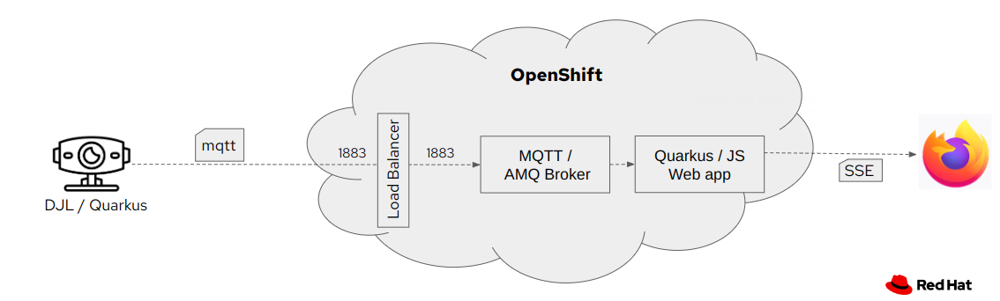
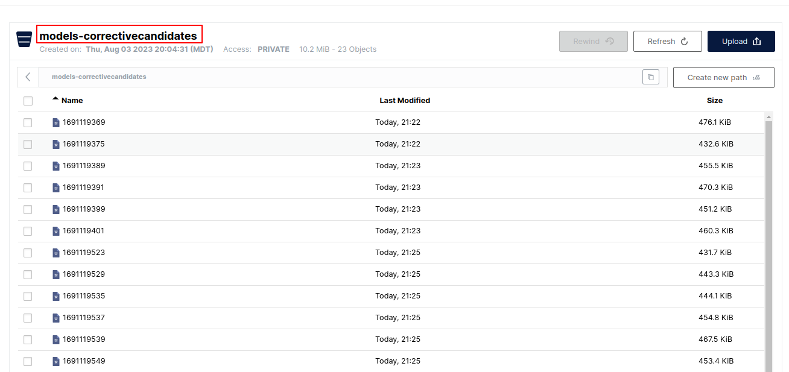
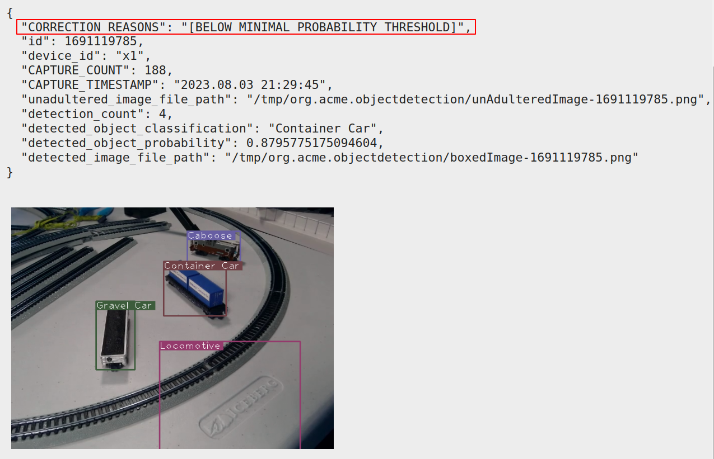
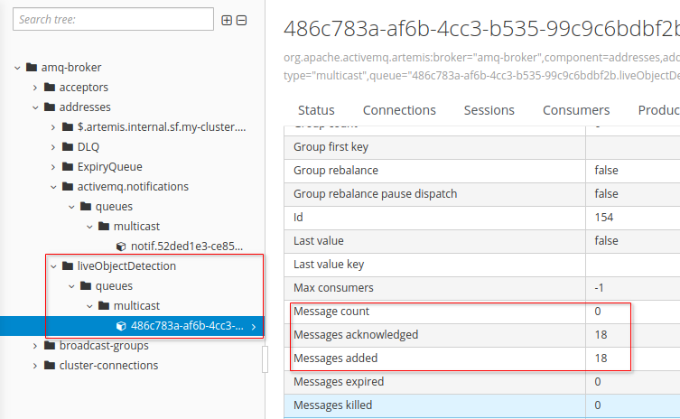
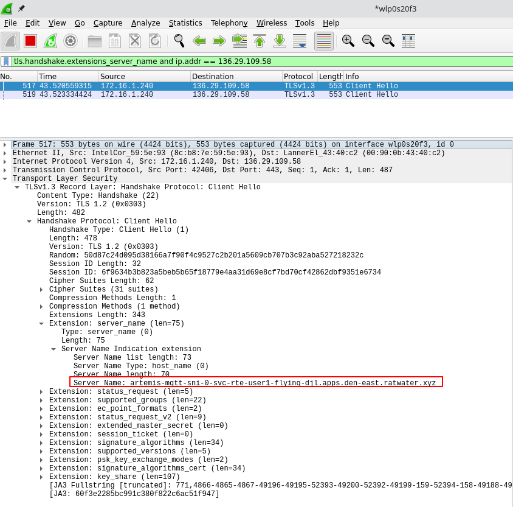

:scrollbar:
:data-uri:
:toc2:
:linkattrs:

= _Intelligence at the Edge_

:numbered:

== Demo Highlights

. *Intelligence at the Edge*
+
Edge application embeds an _Onnx_ engine to run a YOLO5s model for _Live Object Detection_ use case. Edge application is co-located with data-ingestion (ie: video camera).
_Onnx_ engine feeds inference prediction results in real-time to edge application.
Edge application sends MQTT events (with boxed video capture frame and corresponding detection meta-data) only when a state-change (from the previous frame) is identified.

. *Model Correction Candidate Notifications*
+
Edge application has ability to detect if/when the model may be in need of correction.  When these events occur, the edge application will produce an MQTT message containing the problematic image frame and corresponding meta-data.  This MQTT message can subsequently be consumed by a remote business process that re-trains and calibrates the model.

. *Automated & Validated Model Refresh*
+
Edge application can consume an MQTT messages indicating an availability of an updated model version in a remote S3/Minio bucket.  Subsequently, the edge application download that new model.  Prior to loading the updated model, the edge application has the ability to test the validity of this new model.  If the model fails one or more tests, the app will reject the model and roll-back to the previous known-working version of the model.

== Architecture

=== Runtime model inference

As depicted in the above diagram, the demo functionality is split into the following components:

. *Edge*
+
Containerized Quarkus/DJL app that runs on a edge device enabled with a webcam.
Periodically sends events via MQTT when state changes occur (ie:  DJL detects probability that # of detected objects has increased from 2 to 3).

. *AMQ Broker*
+
Deployed to OpenShift.
Enabled with MQTT protocol and exposed via a _LoadBalancer_ service.
_Edge_ component pushes state change events to an AMQ Broker queue.  _Web_ component consumes those event messages.

. *Web*
+
Also deployed to OpenShift is a Quarkus based app that subscribes to the MQTT broker topic and forwards those MQTT events to a web browser (as `Server Sent Events` (SSE)).

=== Model Calibration / Round-Trip

. Edge application has ability to detect if/when the model may be in need of correction.  When these events occur, the edge application will produce an MQTT message.  Web application consumes the MQTT message and POSTs the message to an S3 bucket
+

. The MQTT message contains the problematic image frame and corresponding meta-data.
+

. Based on the content of the MQTT message, a remote business process can re-train and calibrate the model.
. An updated model is pushed to a Minio bucket.  Minio is configured to trigger an MQTT message with details pertaining to this new model.

. Edge application consumes this MQTT message.  Subsequently, the edge application download that new model.  Prior to loading the updated model, the edge application has the ability to test the validity of this new model.  If the model fails one or more tests, the app will reject the model and roll-back to the previous known-working version of the model.

. Metrics regarding the model corrective candidates are provided via a Grafana dashboard:
+

== OpenShift

=== Pre-Reqs

- OpenShift Container Platform 4.12 (or more recent)
. *Resource requirements*
+
Resource requirements as needed by the app (doesn’t include resource requirements of Openshift to support itself) is as follows:

.. RAM: 6 GB

.. CPU: 6

.. Storage: 3 PVCs of type RWO (no RWX requirement) and each of size 5 GiB

. *cluster-admin credentials* to this OpenShift cluster are needed

. *wildcard certificate for routes*
+
Out-of-the-box install of OCP typically includes self-signed certs to secure the cluster's routes.  It is highly recommended that a wildcard cert issued by a well-known certificate authority (ie:  ZeroSSL) be applied to the cluster.

- *oc utility* (of version correspsonding to OCP cluster) installed locally
+
All versions of this utility are available at either of the following:

.. https://access.redhat.com/downloads/content/290
+
RHN subscription required

.. https://mirror.openshift.com/pub/openshift-v4/clients/ocp/?C=M;O=D
+
Accessible without a RHN subscription

=== Deployment

==== Artemis MQTT Remote Access

In this demo, the MQTT acceptor of Red Hat AMQ Artemis needs to be accessed remotely (from outside the OpenShift cluster) by the 'edge' application.  This can be accomplished via either of the following mechanisms:

===== Passthrough TLS

This is the default approach and is configured automatically.
More details of this configuration can be found in the appendix of this document.

===== LoadBalancer service

If your OCP cluster supports a kubernetes _LoadBalancer_ service, then this approach is viable as well.

After deploying the AMQ Broker (in the next section), the network address and MQTT port can be identified similar to the following:

-----
$ oc get service mqtt-lb
NAME      TYPE           CLUSTER-IP       EXTERNAL-IP                                                              PORT(S)          AGE
mqtt-lb   LoadBalancer   172.30.199.169   ad41fc250d7174aa9a27e46e6713109a-238829704.us-east-2.elb.amazonaws.com   1883:31858/TCP   27m
-----

==== Kustomize

. Deployment of Red Hat AMQ Broker operator and creation of `user1-flying-djl` namespace:
+
-----
$ cd flying-djl
$ oc apply -k config_mgmt/gitops/base/infra/
-----

. Wait until AMQ Broker operator is running in `openshift-operators` namespace:
+
-----
$ oc wait \
    --for=condition=ready pod \
    -l name=amq-broker-operator \
    -n openshift-operators
-----
+
Within about a minute, you should see a statement similar to the following:
+
-----
pod/amq-broker-operator-76b7f5985b-w9pwj condition met
-----

. Deploy all apps into `user1-flying-djl` namespace:
+
-----
$ oc apply -k config_mgmt/gitops/base/apps -n user1-flying-djl
-----

=== Admin Consoles

. Environment variables:
+
----- 
$ export MINIO_CONSOLE__URL=https://$(oc get route minio-console -n user1-flying-djl --template='{{ .spec.host }}') \
  && export ARTEMIS_ADMIN_URL=https://$(oc get route artemis-wconsj-0-svc-rte -n user1-flying-djl --template='{{ .spec.host }}') \
  && export LIVE_OBJECT_CONSOLE_URL=https://$(oc get route flying-web -n user1-flying-djl --template='{{ .spec.host }}')/liveObject.html
-----

==== Minio

. Point your browser to the output of the following:
+
-----
$ echo $MINIO_CONSOLE_URL
-----

. login using credentials:  minio / minio123

==== ActiveMQ Artemis

. View mqtt message counts in Artemis admin console

.. Point your browser to the output of the following:
+
-----
$ echo $ARTEMIS_ADMIN_URL
-----

.. Authenticate using the following credentials:  *djl*  /  *djl*
+

. View video capture events in browser

.. Point your browser to the output of the following:
+
-----
$ echo -en $LIVE_OBJECT_CONSOLE
-----

== Edge app
This application can run in your local environment.

=== Pre-reqs

. *Webcam*
+
Should be mounted to your operating system at a path such as:  `/dev/video0`

. *GPU/CPU*
+
This app will auto-detect the presence of a GPU and utilize it if found.
Otherwise, the app will default to a CPU.
+
The app exposes various diagnostic related REST endpoints that provide insight as to the GPU/CPU it has found.

. *Network*
+
You'll need a reliable broadband network due to downloading of a large quantity of library dependencies.

. *JDK11* (or more recent)
+
ie: `sudo dnf install java-latest-openjdk-devel`

. *maven*
+
ie: `sudo dnf install maven`

. *cURL*
+
ie: `sudo dnf install curl`

. *git*
+
ie: `sudo dnf install git`

. *opencv-java*

.. Fedora
+
ie: `sudo dnf install opencv-java`
+
NOTE: opencv-java package places shared C++ object files in a path (/usr/lib/java) typically not included in `java.library.path`.   Subsequently, at runtime you'll need to specify a `java.library.path` that does include this directory.
+
NOTE: RPM packages for `opencv-java` appear to link:https://www.rpmfind.net/linux/rpm2html/search.php?query=opencv-java[only exist] for F36 / RHEL9  (or more recent)

.. RHEL8
+
link:https://www.howtoforge.com/how-to-install-opencv-on-centos-8[opencv-java on RHEL8]

. *gstreamer plugins*

.. Fedora
+
ie: `sudo dnf install gstreamer1-plugin-libav gstreamer1-plugins-bad-free gstreamer1-plugins-good -y`
+
NOTE RPM packages for `gstreamer1-plugin-libav` appear to link:https://packages.fedoraproject.org/pkgs/gstreamer1-plugin-libav/gstreamer1-plugin-libav/[only exist] for F37 (or more recent)

.. RHEL
+
Proprietary gstreamer libraries are available via RPMFusion. ie:
+
-----
$ sudo dnf list gstreamer1-libav.x86_64

...

gstreamer1-libav.x86_64                                    1.16.1-1.el8                                    @rpmfusion-free-updates
-----

==== Optional

. *DJL_CACHE_DIR*
+
DJL engines link:https://djl.ai/docs/development/cache_management.html[download models] and any needed C++ shared object files to a directory specified by the environment variable: `DJL_CACHE_DIR` .  
You are encouraged to set this environment variable in your shell.  
Otherwise, DJL will write these files to: `$HOME/.djl.ai`

=== Edge app project

. On the edge device, clone this project
+
-----
$ git clone https://github.com/redhat-na-ssa/flyingthings
-----

. Switch to `djl` branch:
+
-----
$ cd flyingthings \
    && git checkout djl \
    && cd flying-djl
-----

. Built the `base` sub-project:
+
-----
$ mvn clean install -pl base -am -DskipTests
-----

. Review the properties found in:  `edge/config/application.properties`

=== JVM startup

In this section, you will start the edge app in `quarkus:dev` mode (for smoke-test purposes) and then build/run the edge app as a jar executable.

Depending on the CPU architecture (x86_64 or aarch64) of your edge device, execute steps fouund in one or the other following sections:

==== x86_64

The application can be run locally in quarkus `dev mode` (which enables live coding).

. Run the application in quarkus `dev mode``:
+
-----
(cd edge; mvn quarkus:dev -Djvm.args=-Djava.library.path=/usr/lib/java -P onnx,pytorch)
-----

. View RESTful API exposed by edge app:
+
Open a browser tab and navigate to:  `localhost:8080/q/swagger-ui`

. Build `edge` app:
+
-----
$ ( cd edge; mvn clean package -DskipTests -P onnx,pytorch )
-----

. Start `edge` app in JVM:
+
-----
$ (cd edge; java \
    -Djava.library.path=/usr/lib/java \
    -jar target/quarkus-app/quarkus-run.jar)
-----

. Refresh video and prediction:
+
-----
$ curl -X POST localhost:8080/djl/refreshVideoAndPrediction
-----

==== aarch64

===== Reference

* link:https://github.com/deepjavalibrary/djl/issues/375[DJL Arm Support]

* link:https://github.com/deepjavalibrary/djl/issues/375#issuecomment-1200471807[DJL ARM support] is currently only offered for PyTorch and OnnxRuntime engines.

===== Procedure
. Run `edge` app in `quarkus:dev` mode:
+
-----
$ (cd edge; mvn clean quarkus:dev \
      -Djvm.args=-Djava.library.path=/usr/lib/java \
      -P onnx,pytorch-aarch64 )
-----

.. If running on a recent version of GLIBC (ie: in Fedora 38), you may need to replace the _libstdc++_ library that comes included with DJL's _2.0.1-20230709-cpu-precxx11-linux-aarch64_ package :
+
-----
$ ldd --version
$ strings /usr/lib64/libstdc++.so.6.0.31 | grep '^CXXABI_'
$ cp /usr/lib64/libstdc++.so.6.0.32 $HOME/.djl.ai/pytorch/2.0.1-20230709-cpu-precxx11-linux-aarch64/libstdc++.so.6
-----

.. Doing so will prevent the following exception:
+
-----
22:58:33 ERROR [io.qu.ru.Application] (main) Failed to start application (with profile prod): java.lang.UnsatisfiedLinkError: /tmp/opencv_openpnp10653577782654499938/nu/pattern/opencv/linux/ARMv8/libopencv_java470.so: /home/jbride/.djl.ai/pytorch/2.0.0-cpu-precxx11-linux-aarch64/libstdc++.so.6: version `CXXABI_1.3.8' not found (required by /tmp/opencv_openpnp10653577782654499938/nu/pattern/opencv/linux/ARMv8/libopencv_java470.so)
	at java.base/jdk.internal.loader.NativeLibraries.load(Native Method)
	at java.base/jdk.internal.loader.NativeLibraries$NativeLibraryImpl.open(NativeLibraries.java:388)
	at java.base/jdk.internal.loader.NativeLibraries.loadLibrary(NativeLibraries.java:232)
	at java.base/jdk.internal.loader.NativeLibraries.loadLibrary(NativeLibraries.java:174)
	at java.base/java.lang.ClassLoader.loadLibrary(ClassLoader.java:2389)
	at java.base/java.lang.Runtime.load0(Runtime.java:755)
	at java.base/java.lang.System.load(System.java:1953)
	at nu.pattern.OpenCV$LocalLoader.<init>(OpenCV.java:330)
	at nu.pattern.OpenCV$LocalLoader.<init>(OpenCV.java:326)
	at nu.pattern.OpenCV$LocalLoader$Holder.<clinit>(OpenCV.java:336)
	at nu.pattern.OpenCV$LocalLoader.getInstance(OpenCV.java:340)
	at nu.pattern.OpenCV.loadLocally(OpenCV.java:323)
	at nu.pattern.OpenCV$SharedLoader.<init>(OpenCV.java:217)
	at nu.pattern.OpenCV$SharedLoader.<init>(OpenCV.java:189)
	at nu.pattern.OpenCV$SharedLoader$Holder.<clinit>(OpenCV.java:261)
	at nu.pattern.OpenCV$SharedLoader.getInstance(OpenCV.java:265)
	at nu.pattern.OpenCV.loadShared(OpenCV.java:183)
	at org.acme.apps.LiveObjectDetectionResource.startResource(LiveObjectDetectionResource.java:116)
-----

. Build `edge` app:
+
-----
$ ( cd edge; mvn clean package -DskipTests -P onnx,pytorch-aarch64 )
-----

. Start `edge` app in JVM:
+
-----
$ (cd edge; java \
    -Djava.library.path=/usr/lib/java \
    -jar target/quarkus-app/quarkus-run.jar)
-----

. Refresh video and prediction:
+
-----
$ curl -X POST localhost:8080/djl/refreshVideoAndPrediction
-----

=== (Optional) Linux Containers

==== Pre-reqs:

. *podman*
+
ie:  `dnf install podman`

. *quay.io*
+
Linux container images already exist in `quay.io`.
If you want to push to quay.io, then authenticate as follows:
+
-----
$ podman login quay.io
-----

. To support link:https://github.com/deepjavalibrary/djl-serving/blob/master/serving/docs/configurations.md#djl-settings[off-line mode] of the DJL engines, a pre-seeded DJL cache will be mounted to the linux container.  
emporary directories and/or json files might be generated in this DJL cache.  
This DJL cache directory should be made writable by the container process for the following reasons:

.. Extraction of native C++ libraries included in DJL `fatjar` to $DJL_CACHE_DIR
.. Downloading of any models from DJL's ModelZoo that may be used by the application.

. Make $DJL_CACHE_DIR writable for container process:
+
-----
$ export DJL_CACHE_DIR_OCI=/u02/djl.ai.oci \
    && mkdir -p $DJL_CACHE_DIR_OCI

$ sudo semanage fcontext -a \
        -t container_file_t "$DJL_CACHE_DIR_OCI(/.*)?"

$ sudo restorecon -R $DJL_CACHE_DIR_OCI

$ podman unshare chown -R 185:185 $DJL_CACHE_DIR_OCI
-----

==== Create Linux Container

. Change directory into:  `djl-objectdetect`

. Set an environment variable that specifies one of the possible deep learning engines:
+
-----
$ djl_engine=pytorch
-----
+
NOTE:  Possible options are:  *pytorch*, *mxnet*, or *tensorflow*

. Build container and generate openshift/helm configs:
+
-----
$ mvn clean package \
            -P$djl_engine \
            -Dquarkus.application.name=djl-objectdetect-$djl_engine \
            -DskipTests \
            -Dquarkus.container-image.build=true \
            -Dquarkus.container-image.push=true
-----

==== Execution

. Set an environment variable that specifies one of the possible deep learning engines:
+
-----
$ djl_engine=pytorch
-----
+
NOTE:  Possible options are:  *pytorch*, *mxnet*, or *tensorflow*

. Set environment variable indicating whether to run the DJL engine in offline mode:
+
-----
$ djl_offline=false
-----

. Specify the video card to capture from:
+
-----
$ djl_video=0
-----

. The `djl-objectdetection` container needs access to the host's video card.
+
Podman allows for that however you need to ensure that your host operating system user is a member of the `video` group:
+
-----
$ sudo usermod -a -G video <your OS user name>
-----
+
NOTE: For more info about podman's ability to provide access to the host machine's video card, please review link:https://www.redhat.com/sysadmin/files-devices-podman[this document].

. The `djl-objectdetection` container needs the ability to write video capture images to the filesystem of the host.
Subsequently, in this step you enable the local filesystem to be writable by the container:
+
-----
$ I_DIR=/tmp/org.acme.objectdetection/ \
    && mkdir -p $I_DIR

$ sudo semanage fcontext -a \
        -t container_file_t "$I_DIR(/.*)?"

$ sudo restorecon -R $I_DIR

$ podman unshare chown -R 185:185 $I_DIR
-----

. Run linux container using designated deep learning engine:
+
-----
$ podman run \
    --rm \
    --name djl-objectdetect-$djl_engine \
    -p 8080:8080 \
    -p 5005:5005 \
    -e JAVA_ENABLE_DEBUG="true" \
    -e JAVA_OPTS="-Dquarkus.http.host=0.0.0.0 -Djava.util.logging.manager=org.jboss.logmanager.LogManager -Doffline=$djl_offline -Dorg.acme.objectdetection.video.capture.device.id=$djl_video" \
    -e DJL_CACHE_DIR=/mnt/djl.ai \
    -v $DJL_CACHE_DIR_OCI:/mnt/djl.ai:z \
    --device /dev/video$djl_video \
    --group-add keep-groups \
    -v /tmp/org.acme.objectdetection:/tmp/org.acme.objectdetection:z \
    -v ./config/application.properties:/deployments/config/application.properties:z \
    quay.io/redhat_naps_da/djl-objectdetect-$djl_engine:0.0.3
-----

. View RESTful API exposed by app:
+
Open a browser tab and navigate to:  `localhost:8080/q/swagger-ui`

== Development

=== Base

-----
$ mvn clean install -pl base -am -DskipTests
-----

=== Web app

==== Pre-reqs

. *OpenShift Container Platform*
.. Tested on OCP 4.13  (but earlier versions should also work fine as well)
.. CPU:
+
Plan for 500 millis

.. RAM:
+
Plan for 500Mb RAM

.. Storage:  no PVs needed

. *cURL* (or similar http test utility)
+
ie: `dnf install curl`

==== Build

. Build linux container image and push to quay.io:
+
NOTE:  execute the following from the root parent maven project dir.  ie: `flying-djl`
+
-----
$ mvn clean package -pl web -am \
      -DskipTests \
      -Dquarkus.container-image.build=true \
      -Dquarkus.container-image.push=true
-----

==== Deploy

. Create a ConfigMap from the project's _application.properties_:
+
-----
$ oc create cm djl-iclassification --from-file=config/application.properties
-----

. Determine node that pod landed on:
+
-----
$ oc get pod \
    -l deploymentconfig=djl-iclassification-pytorch \
    -o json \
    -n user1-services \
    | jq -r .items[0].spec.nodeName
-----
+
NOTE: The result should return the id of your GPU enabled node.

== Model Diagnostics

=== Generate onnx default models

==== yolo5s

. Model sizes:

.. pytorch: 15MB
.. onnx: 28MB

. Clone `ultralytics` project and pull down all dependencies:
+
-----
(venv) $ git clone https://github.com/ultralytics/yolov5
(venv) $ (cd yolov5; git checkout v7.0; pip install -r requirements.txt)
-----

. Detect and predict:
+
-----
(venv) $ python yolov5/detect.py \
           --source https://github.com/redhat-na-ssa/flyingthings/blob/djl/flying-djl/docs/images/unAdulteredImage-1690148580.png
-----

. Export to onnx:
+
-----
$ python yolov5/export.py --weight=yolov5/yolov5s.pt --include=onnx
-----

==== yolo8n

. Model sizes:

.. pytorch:  6MB
.. onnx:  13MB

-----
$ deactivate
$ python3.9 -m venv /u02/venv-yolo8
$ source /u02/venv-yolo8/bin/activate
$ pip install -U ultralytics
$ cd %HOME/Downloads/ultralytics/
$ mkdir v8 && cd v8
$ yolo predict model=yolov8n \
    && yolo export model=yolov8n.pt format=onnx
$ zip -r yolov8n-onnx.zip serving.properties synset.txt yolov8n.onnx
-----

=== Prediction using Ultralytics Model Zoo

. Initial setup:
+
-----
$ python3.9 -m venv ~/venv
$ source ~/venv/bin/activate
(venv) $ pip install -U ultralytics
-----

. Predict using `yolo` executable and a model from its model zoo
+
-----
(venv) $  yolo predict \
              model=yolov8n.pt \
              source=flying-djl/docs/images/unAdulteredImage-1690148580.png \
              exist_ok=True

Ultralytics YOLOv8.0.141 🚀 Python-3.11.4 torch-2.0.1+cu117 CPU (11th Gen Intel Core(TM) i7-1185G7 3.00GHz)
YOLOv8n summary (fused): 168 layers, 3151904 parameters, 0 gradients

image 1/1 image 1/1 /u01/labs/mw/redhat-na-ssa/flyingthings/flying-djl/docs/images/unAdulteredImage-1690148580.png: 384x640 1 airplane, 54.5ms
Speed: 1.1ms preprocess, 54.5ms inference, 0.8ms postprocess per image at shape (1, 3, 384, 640)
-----

. Predict using `yolo` executable and custom model:
+
-----
(venv) $ yolo predict \
            model=$HOME/Downloads/flyingthings/model_custom.pt \
            source=docs/images/unAdulteredImage-1690148580.png

Ultralytics YOLOv8.0.141 🚀 Python-3.11.4 torch-2.0.1+cu117 CPU (11th Gen Intel Core(TM) i7-1185G7 3.00GHz)
Model summary (fused): 168 layers, 3006038 parameters, 0 gradients, 8.1 GFLOPs

image 1/1 /u01/labs/mw/redhat-na-ssa/flyingthings/flying-djl/docs/images/unAdulteredImage-1690148580.png: 384x640 1 Fixed Wing, 36.9ms
Speed: 1.6ms preprocess, 36.9ms inference, 0.6ms postprocess per image at shape (1, 3, 384, 640)
-----

=== Detection using Ultralytics `detect.py`

. Detect using custom model:
+
-----
(venv) $ pip install dill
(venv) $ python yolov5/detect.py \
         --source https://github.com/redhat-na-ssa/flyingthings/blob/djl/flying-djl/docs/images/unAdulteredImage-1690148580.png \
         --weights ~/Downloads/flyingthings/model_custom.pt

Model summary (fused): 168 layers, 3006038 parameters, 0 gradients, 8.1 GFLOPs
Traceback (most recent call last):
  File "/u01/ai/ultralytics/yolov5/detect.py", line 261, in <module>
    main(opt)
  File "/u01/ai/ultralytics/yolov5/detect.py", line 256, in main
    run(**vars(opt))
  File "/home/jbride/venv/lib64/python3.11/site-packages/torch/utils/_contextlib.py", line 115, in decorate_context
    return func(*args, **kwargs)
           ^^^^^^^^^^^^^^^^^^^^^
  File "/u01/ai/ultralytics/yolov5/detect.py", line 160, in run
    s += f"{n} {names[int(c)]}{'s' * (n > 1)}, "  # add to string
                ~~~~~^^^^^^^^
KeyError: 1994
-----

=== onnx

-----
(venv) $ python export.py --include=onnx
-----

=== aarch64 (Pi 4)

. video file processing requires appropriate gstreamer-plugins (webcam processing apparently does not)
. those gstreamer-plugins (along with opencv) are compiled using glibc++ libraries for F38
. DJL pytorch libraries (required when running onnxruntime engine) are compiled using an older version of glibc++
. Attempt to install torch libraries via pip and reference when DJL starts-up
. DJL JNI wrappers for triplet (DJL version, aarch64 cpu, pytorch version) doesn't exist

-----
$ mvn clean quarkus:dev -Djvm.args=-Djava.library.path=/usr/lib/java -P onnx,pytorch-aarch64

Caused by: java.lang.UnsatisfiedLinkError: /usr/lib/java/libopencv_java470.so: /home/jbride/.djl.ai/pytorch/2.0.1-20230709-cpu-precxx11-linux-aarch64/libstdc++.so.6: version `GLIBCXX_3.4.29' not found (required by /usr/lib/java/libopencv_java470.so)
	at java.base/jdk.internal.loader.NativeLibraries.load(Native Method)
	at java.base/jdk.internal.loader.NativeLibraries$NativeLibraryImpl.open(NativeLibraries.java:388)
	at java.base/jdk.internal.loader.NativeLibraries.loadLibrary(NativeLibraries.java:232)
	at java.base/jdk.internal.loader.NativeLibraries.loadLibrary(NativeLibraries.java:174)
	at java.base/jdk.internal.loader.NativeLibraries.findFromPaths(NativeLibraries.java:315)
	at java.base/jdk.internal.loader.NativeLibraries.loadLibrary(NativeLibraries.java:287)
	at java.base/java.lang.ClassLoader.loadLibrary(ClassLoader.java:2422)
	at java.base/java.lang.Runtime.loadLibrary0(Runtime.java:818)
	at java.base/java.lang.System.loadLibrary(System.java:1989)
	at nu.pattern.OpenCV$SharedLoader.<init>(OpenCV.java:200)

$ strings /home/jbride/.djl.ai/pytorch/2.0.1-20230709-cpu-precxx11-linux-aarch64/libstdc++.so.6 | grep GLIBCXX

...
GLIBCXX_3.4.19

$ strings /usr/lib64/libstdc++.so.6 | grep GLIBCXX

...
GLIBCXX_3.4.32

-----

-----
$ sudo dnf install python39
$ python3.9 -m ensurepip --default-pip
$ python3.9 -m pip install torch
$ python3.9 -m pip show -f torch | grep Location
$ python3.9 -m pip show -f torch | grep Version
$ export PYTORCH_LIBRARY_PATH=/home/jbride/.local/lib/python3.9/site-packages/torch/lib \
    && export PYTORCH_VERSION=2.0.1 \
    && export PYTORCH_FLAVOR=cpu
$ (cd edge; mvn clean quarkus:dev -Djvm.args=-Djava.library.path=/usr/lib/java -Ponnx)

Caused by: java.io.FileNotFoundException: https://publish.djl.ai/pytorch/2.0.1/jnilib/0.23.0/linux-aarch64/cpu/libdjl_torch.so
	at java.base/sun.net.www.protocol.http.HttpURLConnection.getInputStream0(HttpURLConnection.java:1993)
	at java.base/sun.net.www.protocol.http.HttpURLConnection.getInputStream(HttpURLConnection.java:1589)
	at java.base/sun.net.www.protocol.https.HttpsURLConnectionImpl.getInputStream(HttpsURLConnectionImpl.java:224)
	at java.base/java.net.URL.openStream(URL.java:1161)
	at ai.djl.util.Utils.openUrl(Utils.java:463)
	at ai.djl.util.Utils.openUrl(Utils.java:447)
	at ai.djl.pytorch.jni.LibUtils.downloadJniLib(LibUtils.java:509)
	... 44 more

$ ls -lt ~/.djl.ai/pytorch/2.0.1-20230709-cpu-precxx11-linux-aarch64/
0.23.0-libdjl_torch.so            libarm_compute_core-0793f69d.so   libc10.so                         libgomp-efb3da07.so.1.0.0         libtorch_cpu.so                   
libarm_compute-23619548.so        libarm_compute_graph-ebe58799.so  libgomp-d22c30c5.so.1.0.0         libstdc++.so.6                    libtorch.so

-----

== Appendix

=== Artemis TLS Passthrough 

* Reference:

** link:https://artemiscloud.io/docs/tutorials/external_mqtt_clients/[Artemis Cloud: external clients]
** link:https://smallrye.io/smallrye-reactive-messaging/smallrye-reactive-messaging/3.4/mqtt/mqtt.html[SmallRye Reactive Messaging: MQTT]

. TO-DO:  
.. Why is a client not able to connect to an mqtt artemis acceptor via an unencrypted route ?????
.. link:https://artemiscloud.io/docs/tutorials/cert-manager-and-trust-manager/[Use Cert Manager]

. Review/modify configuration of the Artemis broker to be deployed to OpenShift:

.. In a text editor, open the following config file in this project: `config_mgmt/gitops/base/amq-broker-app/kubernetes.yml`

.. Review the following section of the config:
+
-----
    # https://artemiscloud.io/docs/tutorials/external_mqtt_clients/
    - name: mqtt-tls
      port: 1884     # de-conflict port with default mqtt address
      protocols: mqtt
      expose: true
      sslEnabled: true
      sslSecret: artemis-tls-secret
-----
+
If not intending to use passthrough TLS for remote access, comment this entire section out.

. Acquire test server and client certificates:
+
-----
$ A_CERTS_DIR=.artemis_certs && mkdir -p $A_CERTS_DIR

$ wget -O $A_CERTS_DIR/server-keystore.jks https://github.com/apache/activemq-artemis/raw/main/tests/security-resources/server-keystore.jks \
    && wget -O $A_CERTS_DIR/client-ca-truststore.jks https://github.com/apache/activemq-artemis/raw/main/tests/security-resources/client-ca-truststore.jks
-----

. Create a kubernetes secret with both server and client certificates:
+
-----
$ kubectl create secret generic artemis-tls-secret \
    -n user1-flying-djl \
    --from-file=broker.ks=$A_CERTS_DIR/server-keystore.jks \
    --from-file=client.ts=$A_CERTS_DIR/client-ca-truststore.jks \
    --from-literal=keyStorePassword=securepass \
    --from-literal=trustStorePassword=securepass
-----

. X509 certificate:

.. Create certificate using keytool:
+
-----
$ wget -O $A_CERTS_DIR/server-ca-keystore.p12 https://github.com/apache/activemq-artemis/raw/main/tests/security-resources/server-ca-keystore.p12
$ keytool -storetype pkcs12 -keystore \
    $A_CERTS_DIR/server-ca-keystore.p12 \
    -storepass securepass -alias server-ca -exportcert -rfc > $A_CERTS_DIR/server-ca.crt
-----

.. Inspect certificate:
+
-----
$ openssl x509 -in $A_CERTS_DIR/server-ca.crt -text
-----

=== Test MQTT via TLS Passthrough

If edge app is to connect to remote MQTT acceptor of remote AMQ Artemis broker via TLS Passthrough, test as follows:

. Wireshark display filter:
+
-----
tls.handshake.extensions_server_name and ip.addr == 136.29.109.58
-----
+

. Invoke the remote Artemis broker using an mqtt client:
+
-----
$ export ARTEMIS_MQTT_HOST=$(oc get route artemis-mqtt-tls-0-svc-rte -n user1-flying-djl --template='{{ .spec.host }}')
$ mosquitto_pub -d --insecure -t "ExpiryQueue" -m "test" -u admin -P admin  -h $ARTEMIS_MQTT_HOST -p 443 --cafile $A_CERTS_DIR/server-ca.crt
-----
